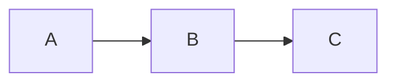

# Count App Documentation

This directory contains the comprehensive documentation for Count App, built with [MkDocs](https://www.mkdocs.org/) and the [Material for MkDocs](https://squidfunk.github.io/mkdocs-material/) theme.

## 📚 Documentation Structure

```
docs/
├── index.md                    # Home page
├── getting-started/            # Installation and setup
│   ├── installation.md
│   ├── quick-start.md
│   ├── building.md
│   └── configuration.md
├── architecture/               # System architecture
│   ├── overview.md
│   ├── core-concepts.md
│   ├── counter-system.md
│   ├── state-management.md
│   ├── data-persistence.md
│   └── theme-system.md
├── api/                        # API reference
│   ├── base-counter.md
│   ├── counter-factory.md
│   ├── tap-counter.md
│   ├── counter-provider.md
│   ├── theme-notifier.md
│   ├── statistics.md
│   ├── widgets.md
│   ├── files.md
│   ├── permissions.md
│   └── migration.md
├── guides/                     # How-to guides
│   ├── adding-counter-types.md
│   ├── statistics.md
│   ├── themes.md
│   ├── import-export.md
│   ├── testing.md
│   └── contributing.md
├── user-guide/                 # End-user documentation
│   ├── features.md
│   ├── creating-counters.md
│   ├── managing-counters.md
│   ├── statistics.md
│   └── settings.md
├── development/                # Development guides
│   ├── build-system.md
│   ├── cicd.md
│   ├── release-process.md
│   └── code-generation.md
└── about/                      # Project information
    ├── changelog.md
    └── license.md
```

## Viewing Documentation

### Online

The documentation is automatically deployed to GitHub Pages:

**https://kingbenny101.github.io/countapp/**

### Local Development

#### Prerequisites

- Python 3.8+
- pip

#### Setup

1. **Install dependencies**:

```bash
pip install -r requirements.txt
```

2. **Serve locally**:

```bash
mkdocs serve
```

3. **Open in browser**:

```
http://localhost:8000
```

The documentation will auto-reload when you make changes.

## 🛠️ Building Documentation

### Build static site

```bash
mkdocs build
```

Output is in `site/` directory.

### Deploy to GitHub Pages

Deployment is automated via GitHub Actions. To deploy manually:

```bash
mkdocs gh-deploy
```

This builds and pushes to the `gh-pages` branch.

## ✍️ Writing Documentation

### Style Guide

- **Clear and Concise**: Write in simple, direct language
- **Code Examples**: Include practical examples for all APIs
- **Diagrams**: Use Mermaid for architecture diagrams
- **Links**: Cross-reference related documentation
- **Admonitions**: Use for tips, warnings, and notes

### Markdown Extensions

MkDocs Material supports rich markdown:

#### Code Blocks

````markdown
```dart
void main() {
  print("Hello, World!");
}
```
````

#### Admonitions

```markdown
!!! note "Note Title"
This is a note.

!!! warning "Warning"
This is a warning.

!!! tip "Tip"
This is a tip.
```

#### Tabs

```markdown
=== "Tab 1"
Content for tab 1

=== "Tab 2"
Content for tab 2
```

#### Diagrams

````markdown

````

\```

````

#### Tables

```markdown
| Column 1 | Column 2 |
|----------|----------|
| Value 1  | Value 2  |
````

## Contributing to Documentation

### Making Changes

1. **Fork and clone** the repository
2. **Create a branch**: `git checkout -b docs/my-improvement`
3. **Make changes** in the `docs/` directory
4. **Test locally**: `mkdocs serve`
5. **Commit**: `git commit -m "docs: improve installation guide"`
6. **Push**: `git push origin docs/my-improvement`
7. **Create Pull Request**

### Documentation Checklist

- [ ] Changes are clear and accurate
- [ ] Code examples are tested
- [ ] Links work correctly
- [ ] Spelling and grammar checked
- [ ] Diagrams are readable
- [ ] Screenshots updated (if needed)

## Configuration

Documentation configuration is in `mkdocs.yml`:

```yaml
site_name: Count App Documentation
theme:
  name: material
  palette:
    - scheme: default
      primary: blue
      accent: indigo
  features:
    - navigation.tabs
    - navigation.sections
    - toc.follow
    - search.suggest
```

## 📦 Requirements

Dependencies are in `requirements.txt`:

```
mkdocs-material>=9.5.0
pymdown-extensions>=10.7
mkdocs-glightbox>=0.3.7
```

## 🤖 Automated Deployment

Documentation is automatically deployed via GitHub Actions when:

- Changes are pushed to `master` or `dev` branch
- Files in `docs/` or `mkdocs.yml` are modified
- Workflow: `.github/workflows/docs.yml`

### Workflow Steps

1. Checkout repository
2. Set up Python
3. Install dependencies
4. Deploy to GitHub Pages with `mkdocs gh-deploy`

## 📄 License

Documentation is licensed under [CC BY 4.0](https://creativecommons.org/licenses/by/4.0/).

You are free to:

- Share and adapt the documentation
- Use for any purpose, even commercially

Under the following terms:

- Give appropriate credit
- Indicate if changes were made

## 🔗 Links

- **Documentation**: https://kingbenny101.github.io/countapp/
- **Repository**: https://github.com/KingBenny101/countapp
- **MkDocs**: https://www.mkdocs.org/
- **Material for MkDocs**: https://squidfunk.github.io/mkdocs-material/

## 📧 Support

For documentation issues:

- Open an [issue](https://github.com/KingBenny101/countapp/issues)
- Submit a [pull request](https://github.com/KingBenny101/countapp/pulls)

---

Thank you for contributing to Count App documentation! 📚
