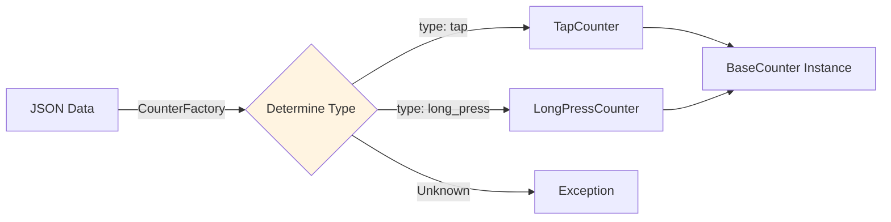
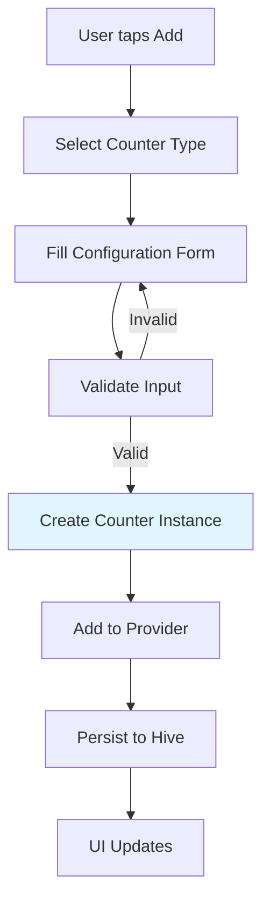
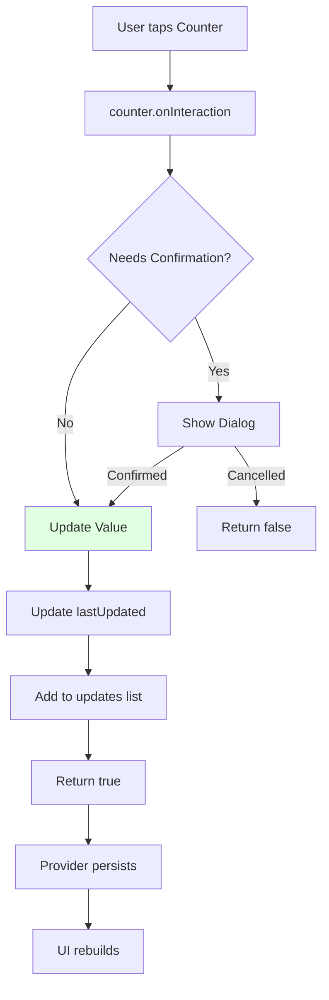
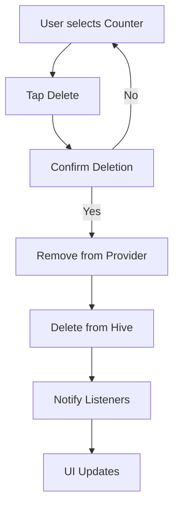
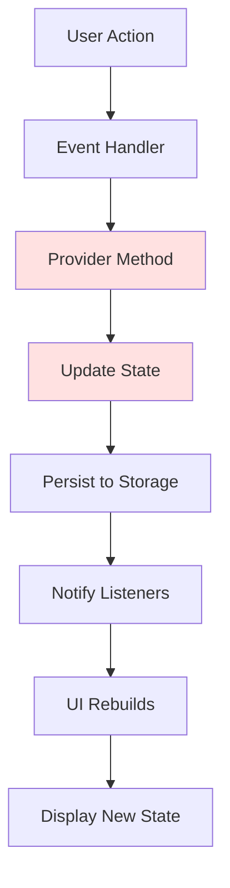
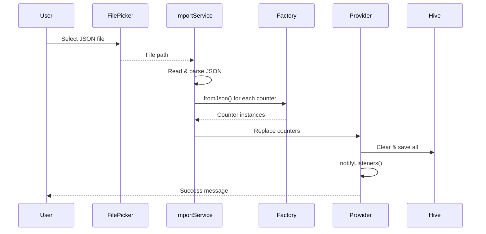
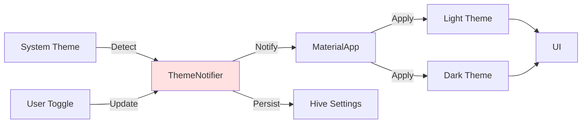
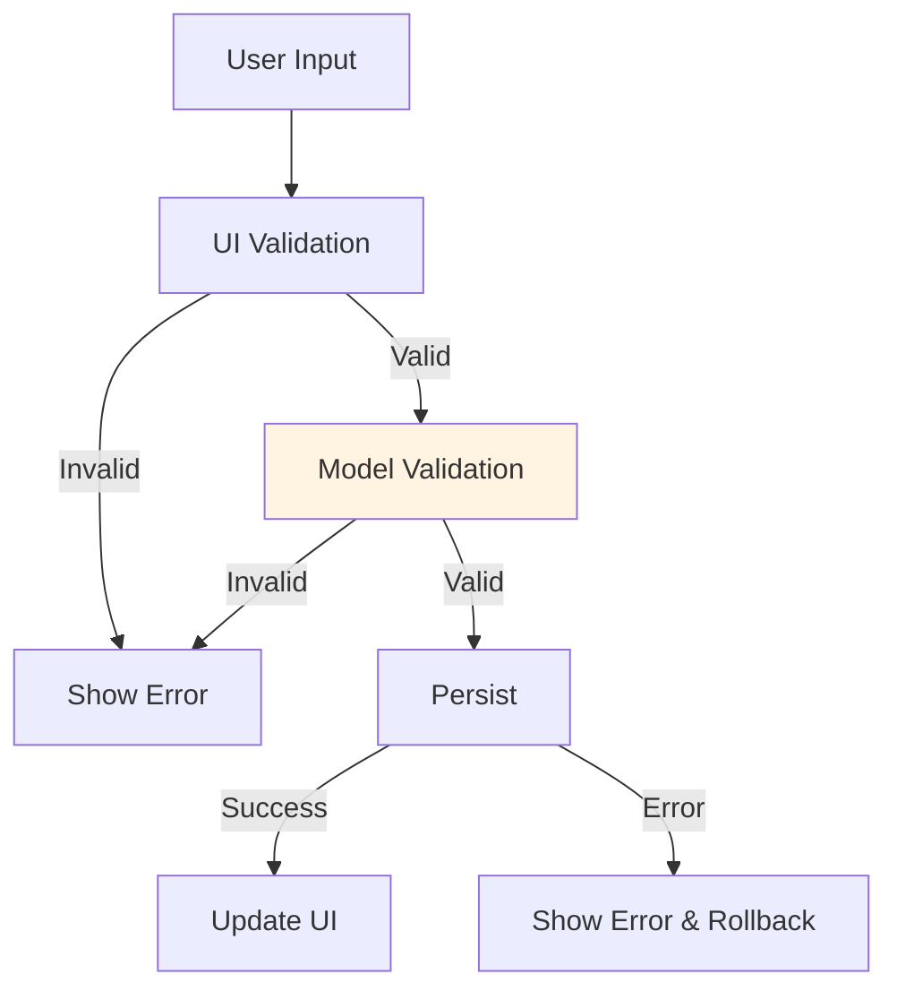
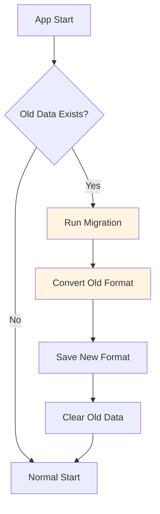

# Core Concepts

## Counter Abstraction

All counters extend the `BaseCounter` abstract class, enabling polymorphism and extensibility.

**Benefits:**

- Add new counter types without modifying existing code
- Consistent interface for UI
- Easy testing through common interface

## State Management

Uses the **Provider pattern** with `ChangeNotifier`:

```dart
// Provider holds state
class CounterProvider extends ChangeNotifier {
  List<BaseCounter> counters = [];

  Future<void> updateCounter(int index) async {
    await counters[index].onInteraction(context);
    notifyListeners(); // UI rebuilds
    await _saveCounters();
  }
}
```

**Flow:**

1. UI reads state from Provider
2. User action triggers Provider method
3. Provider updates state
4. `notifyListeners()` rebuilds UI
5. Changes persisted to storage

## Data Persistence

**Hive CE** provides type-safe binary storage:

- Fast local database
- Generated type adapters
- Automatic serialization
- Cross-platform support

**Type Adapters:**

```dart
@HiveType(typeId: 1)
class TapCounter extends BaseCounter {
  @HiveField(0)
  final int stepSize;

  // ... fields with @HiveField annotations
}
```

Generate with: `dart run build_runner build`

## Factory Pattern

`CounterFactory` creates counters from JSON:

```dart
BaseCounter counter = CounterFactory.fromJson({
  "counterType": "tap",
  "name": "My Counter",
  // ...
});
```

This enables:

- Import/export functionality
- Dynamic counter creation
- Type-safe deserialization

- **Type Safety**: Generated adapters prevent serialization errors
- **Performance**: Binary format is fast and compact
- **Cross-Platform**: Works identically on all platforms
- **No Dependencies**: Pure Dart, no native code
- **Simple API**: Boxes work like key-value stores

### Type Adapters

Type adapters bridge the gap between Dart objects and binary storage:

```dart
@HiveType(typeId: 1)
class TapCounter extends BaseCounter {
  @HiveField(0)
  final int stepSize;

  @HiveField(1)
  final bool isIncrement;

  // ... more fields
}

// Generated adapter handles serialization
class TapCounterAdapter extends TypeAdapter<TapCounter> {
  @override
  TapCounter read(BinaryReader reader) { /* ... */ }

  @override
  void write(BinaryWriter writer, TapCounter obj) { /* ... */ }
}
```

**Type IDs**:

- Must be **unique** per type
- **Immutable** once in production
- Used to identify types during deserialization

## Factory Pattern

The `CounterFactory` enables **dynamic type instantiation** from JSON:

```dart
static BaseCounter fromJson(Map<String, dynamic> json) {
  final type = json["counterType"] as String?;

  switch (type) {
    case "tap":
      return TapCounter.fromJson(json);
    case "long_press":
      return LongPressCounter.fromJson(json);
    // More types...
    default:
      throw ArgumentError("Unknown counter type: $type");
  }
}
```

**Usage Pattern**:



**Benefits**:

- Decouples deserialization from specific types
- Centralizes type registration
- Easy to extend with new types

## Counter Lifecycle

### Creation



### Update



### Deletion



## Data Flow Architecture

### Unidirectional Data Flow



**Rules**:

1. **Actions** trigger state changes through providers
2. **State** is updated in one place (provider)
3. **Persistence** happens automatically
4. **UI** reacts to state changes

### Read vs Write Operations

**Read Operations** (Fast):

```dart
// Direct access, no async
final counters = Provider.of<CounterProvider>(context).counters;
final counter = counters[index];
```

**Write Operations** (Async):

```dart
// Async for persistence
await provider.addCounter(counter);
await provider.updateCounter(context, index);
await provider.removeCounter(index);
```

## JSON Serialization

### Export Format

Counters are exported as JSON arrays:

```json
{
  "version": "1.4.0",
  "exportDate": "2025-12-10T15:30:00.000Z",
  "counters": [
    {
      "counterType": "tap",
      "id": "uuid-1",
      "name": "Water Intake",
      "value": 8,
      "stepSize": 1,
      "isIncrement": true,
      "requireConfirmation": true,
      "lastUpdated": "2025-12-10T15:30:00.000Z",
      "updates": ["2025-12-10T15:30:00.000Z", "2025-12-10T14:20:00.000Z"]
    }
  ]
}
```

### Import Process



## Update Tracking

### Update History

Each counter maintains a chronological history:

```dart
List<DateTime> updates = [
  DateTime(2025, 12, 10, 15, 30),  // Most recent
  DateTime(2025, 12, 10, 14, 20),
  DateTime(2025, 12, 09, 18, 45),
  // ... older updates
];
```

**Usage**:

- Statistics calculations
- Chart generation
- Activity patterns
- History display

### Statistics Computation

Using the `DateStatistics` utility class:

```dart
// Group by day
final byDay = DateStatistics.groupUpdatesByDay(updates);

// Count frequency
final frequency = DateStatistics.countDaysByUpdateFrequency(updates);

// Calculate averages
final avgPerDay = DateStatistics.calculateAverageUpdatesPerDay(updates);

// Find patterns
final mostActive = DateStatistics.findMostActiveTimeWindow(updates);
```

## Theme System

### Dynamic Theming



**Features**:

- Auto-detect system theme
- Manual toggle
- Persisted preference
- Smooth transitions

## Error Handling

### Validation Layers



**Validation Points**:

1. **UI Level**: Form validators, input formatters
2. **Model Level**: `validate()` method
3. **Storage Level**: Hive type checking

### Error Recovery

```dart
try {
  await provider.updateCounter(context, index);
} catch (e) {
  // Show error to user
  ScaffoldMessenger.of(context).showSnackBar(
    SnackBar(content: Text("Error: $e")),
  );
  // State remains unchanged
}
```

## Performance Optimization

### Efficient Rendering

**ListView.builder**:

```dart
// Only builds visible items
ListView.builder(
  itemCount: counters.length,
  itemBuilder: (context, index) {
    return CounterTile(counter: counters[index]);
  },
)
```

**Selective Rebuilds**:

```dart
// Only rebuild when counters change
Consumer<CounterProvider>(
  builder: (context, provider, child) {
    return CounterList(counters: provider.counters);
  },
)
```

### Lazy Loading

```dart
// Hive boxes opened only when needed
Future<Box> _getBox() async {
  _box ??= await Hive.openBox(AppConstants.countersBox);
  return _box!;
}
```

## Migration Strategy

### Backward Compatibility

Supporting old data formats:

```dart
factory TapCounter.fromJson(Map<String, dynamic> json) {
  // Support multiple field names
  bool isInc;
  if (json.containsKey("type")) {
    isInc = json["type"] == "increment";  // Old format
  } else if (json.containsKey("direction")) {
    isInc = json["direction"] == "increment";  // Older format
  } else {
    isInc = json["isIncrement"] as bool;  // Current format
  }
  // ...
}
```

### Migration Process



## Key Takeaways

1. **Abstraction** enables extensibility and maintainability
2. **Provider** manages state reactively and predictably
3. **Hive** provides fast, type-safe persistence
4. **Factory** pattern enables dynamic type creation
5. **Validation** happens at multiple layers for robustness
6. **Performance** is optimized through lazy loading and selective rendering

## Next Steps

- **[Counter System →](counter-system.md)** - Deep dive into counter architecture
- **[State Management →](state-management.md)** - Provider pattern details
- **[Data Persistence →](data-persistence.md)** - Hive storage internals
