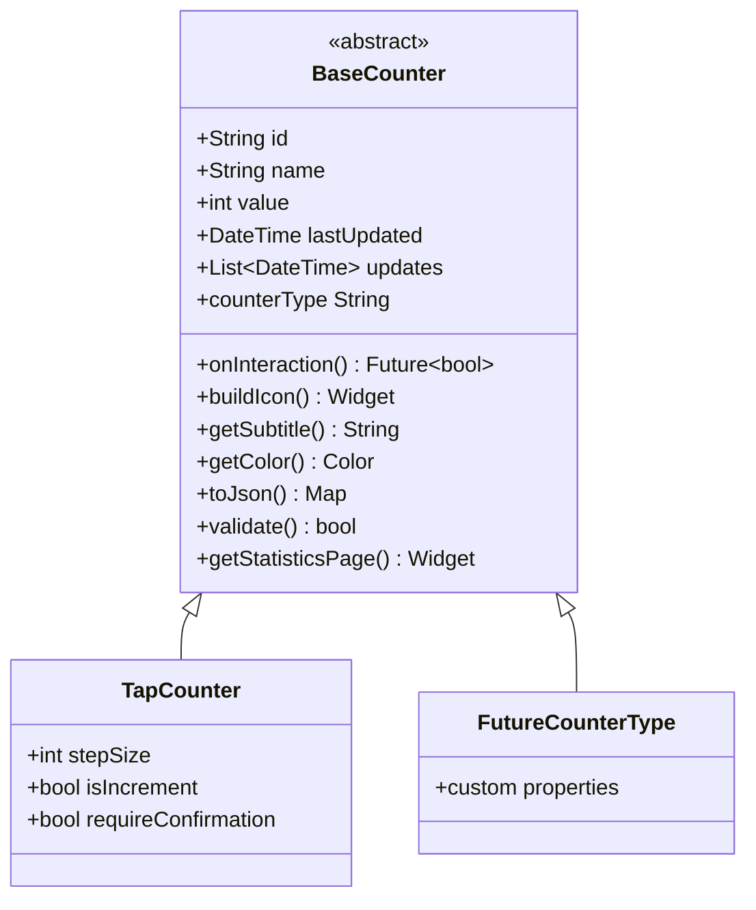
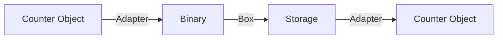

# Counter System Architecture

Detailed documentation of the counter system architecture and design patterns.

## Overview

The counter system is built on a foundation of abstract base classes, polymorphism, and the factory pattern to enable extensibility while maintaining a consistent interface.

## Class Hierarchy



## Design Patterns

### Abstract Factory Pattern

The `CounterFactory` uses the Abstract Factory pattern to create counter instances:

```dart
BaseCounter counter = CounterFactory.fromJson(jsonData);
```

**Benefits**:

- Decouples client code from concrete classes
- Centralizes type registration
- Easy to extend with new types

### Strategy Pattern

Each counter type implements its own update strategy via `onInteraction()`:

```dart
@override
Future<bool> onInteraction(BuildContext context) async {
  // Counter-specific update logic
}
```

### Template Method Pattern

The base class provides template methods with default implementations that can be overridden:

```dart
bool validate() {
  return name.isNotEmpty; // Default validation
}
```

## Polymorphic Behavior

### Type-Specific Icons

Each counter displays a unique icon:

```dart
@override
Widget buildIcon() {
  return CircleAvatar(
    backgroundColor: getColor(),
    child: Icon(typeSpecificIcon),
  );
}
```

### Type-Specific Colors

Each counter type has its own color:

```dart
@override
Color getColor() => Colors.blueAccent; // TapCounter
// Colors.deepPurple for LongPressCounter
// Colors.green for SwipeCounter
```

### Type-Specific Statistics

Counters can provide custom statistics pages:

```dart
@override
Widget? getStatisticsPage(int index) {
  return CustomStatisticsPage(counter: this);
}
```

## Extensibility Points

To add a new counter type:

1. **Extend BaseCounter**
2. **Implement abstract methods**
3. **Add Hive annotations**
4. **Register in factory**
5. **Create configuration UI**

See [Adding Counter Types](../guides/adding-counter-types.md) for details.

## Persistence Layer

### Hive Integration



### Type Registration

Each counter type requires a unique Hive typeId:

```dart
@HiveType(typeId: 1)  // TapCounter
@HiveType(typeId: 3)  // Next counter type
```

## State Management Integration

Counters integrate with Provider for reactive updates:

```dart
// Update counter
await provider.updateCounter(context, index);

// Provider notifies listeners
notifyListeners();

// UI rebuilds automatically
```

## Next Steps

- [BaseCounter API](../api/base-counter.md)
- [Adding Counter Types](../guides/adding-counter-types.md)
- [Core Concepts](core-concepts.md)
