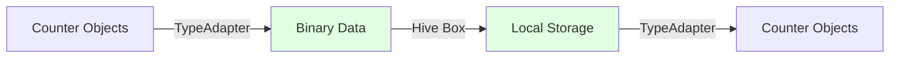

# Data Persistence

Documentation of the data persistence layer using Hive CE.

## Hive CE Overview

Hive CE is a lightweight, fast NoSQL database designed for Flutter applications.

## Storage Architecture



## Boxes

Hive uses "boxes" as key-value stores:

```dart
// Settings box (opened at startup)
final settingsBox = await Hive.openBox(AppConstants.settingsBox);

// Counters box (lazy loaded)
final countersBox = await Hive.openBox(AppConstants.countersBox);
```

## Type Adapters

### Generated Adapters

Type adapters are generated by `build_runner`:

```dart
@HiveType(typeId: 1)
class TapCounter extends BaseCounter {
  @HiveField(0)
  final int stepSize;

  @HiveField(1)
  final bool isIncrement;
}
```

Generates `TapCounterAdapter` in `*.g.dart` file.

### Registration

Adapters are registered automatically via generated code:

```dart
import 'package:countapp/hive_registrar.g.dart';

void main() async {
  await Hive.initFlutter();
  Hive.registerAdapters();
}
```

## CRUD Operations

### Create (Add)

```dart
final box = await Hive.openBox('counters');
await box.add(counter.toJson());
```

### Read (Load)

```dart
final values = box.values;
final counters = values.map((json) =>
    CounterFactory.fromJson(json)
).toList();
```

### Update

```dart
await box.putAt(index, counter.toJson());
```

### Delete

```dart
await box.deleteAt(index);
```

## Storage Locations

### Android

```
/data/data/com.kingbenny101.countapp/files/
```

### Windows

```
%APPDATA%\countapp\
```

### Linux

```
~/.local/share/countapp/
```

## Data Migration

Migration from old data formats:

```dart
class CounterMigration {
  static Future<void> migrateIfNeeded() async {
    final oldBox = await Hive.openBox<Counter>("countersBox");
    // Migration logic
  }
}
```

## Best Practices

1. **Use TypeId**: Assign unique typeIds to avoid conflicts
2. **Lazy Loading**: Open boxes only when needed
3. **Atomic Operations**: Use transactions for multiple updates
4. **Error Handling**: Wrap storage operations in try-catch
5. **Backup**: Implement export/import for user backups

## Performance

- **Fast**: Binary format is optimized for speed
- **Compact**: Efficient storage with small overhead
- **Lazy**: Boxes loaded on-demand
- **Cached**: In-memory caching for frequent access

## See Also

- [Core Concepts](core-concepts.md)
- [Migration](../api/migration.md)
- [Architecture Overview](overview.md)
