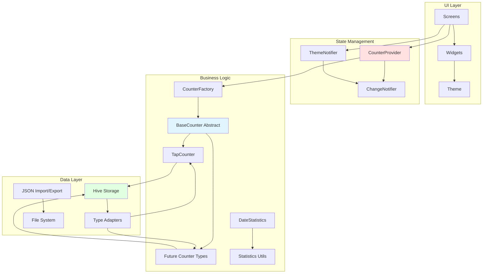
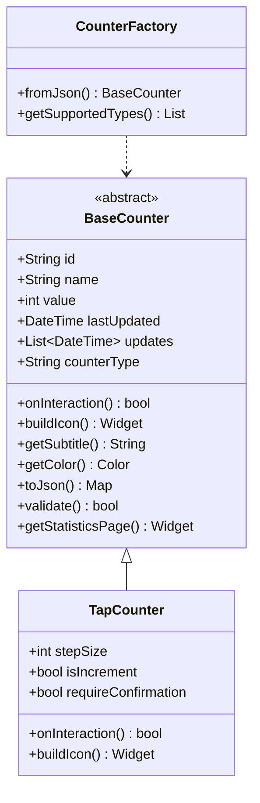
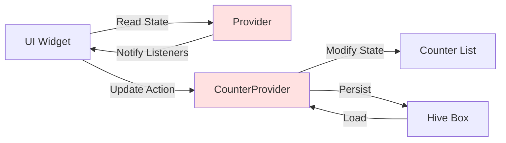
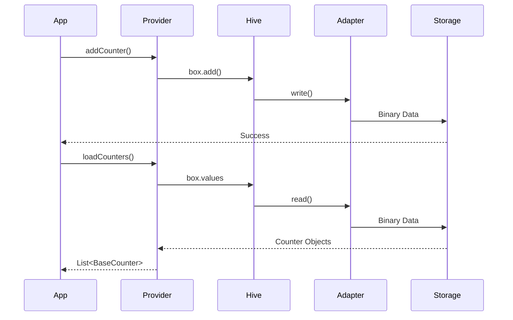
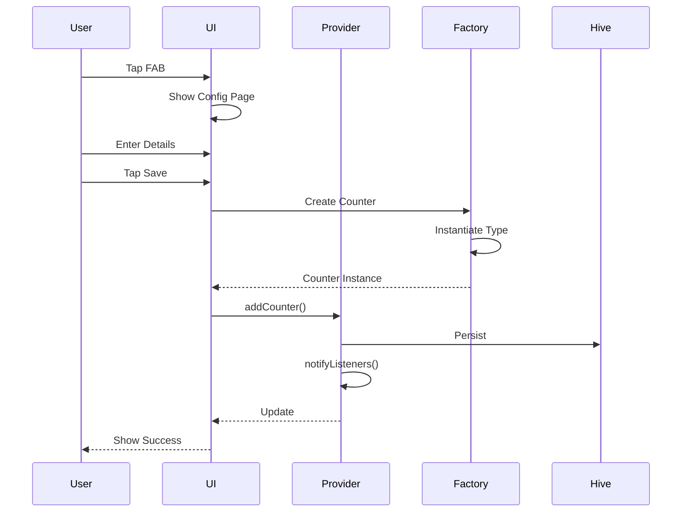
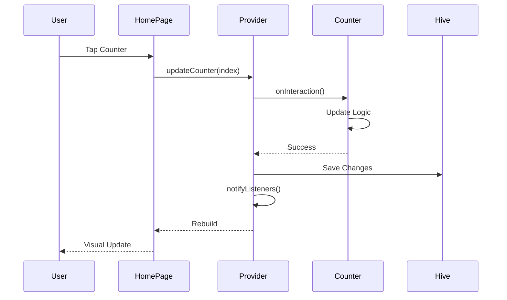
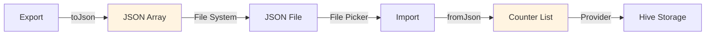

# Architecture Overview

Count App is built with a clean, modular architecture that emphasizes extensibility, maintainability, and testability. This document provides a high-level overview of the system design.

## Architecture Diagram



## Architectural Principles

### 1. Separation of Concerns

Each layer has a distinct responsibility:

- **UI Layer**: Presentation and user interaction
- **State Management**: Application state and reactivity
- **Business Logic**: Counter behavior and rules
- **Data Layer**: Persistence and serialization

### 2. Extensibility

The architecture supports adding new features without modifying existing code:

- Abstract base classes define contracts
- Factory pattern for dynamic type creation
- Polymorphic method dispatch
- Plugin-like counter system

### 3. Type Safety

Strong typing throughout the codebase:

- Dart's null safety
- Hive's typed storage
- Code generation for adapters
- Generic utilities where appropriate

### 4. Testability

Design facilitates testing:

- Dependency injection via Provider
- Pure functions in utilities
- Mockable interfaces
- Isolated counter logic

## Core Components

### Counter System



**Key Features:**

- **Polymorphism**: All counters implement `BaseCounter`
- **Self-Contained**: Each counter manages its own logic
- **Factory Pattern**: Dynamic instantiation from JSON
- **Extensible**: Add new types without modifying existing code

### State Management



**Provider Pattern:**

- `CounterProvider`: Manages counter list and operations
- `ThemeNotifier`: Handles theme state
- `ChangeNotifier`: Reactive updates to UI
- Scoped providers for efficient rebuilds

### Data Persistence



**Hive CE Storage:**

- Type-safe binary serialization
- Generated type adapters
- Lazy box initialization
- Atomic transactions

## Directory Structure

```
lib/
├── counters/                   # Counter implementations
│   ├── base/                   # Base classes and factory
│   │   ├── base_counter.dart   # Abstract base class
│   │   └── counter_factory.dart # Factory for instantiation
│   └── tap_counter/            # TapCounter implementation
│       ├── tap_counter.dart    # Main class
│       ├── tap_counter.g.dart  # Generated adapter
│       ├── tap_counter_config.dart     # Config UI
│       ├── tap_counter_statistics.dart # Statistics UI
│       └── tap_counter_updates.dart    # Updates UI
├── models/                     # Legacy data models
│   └── counter_model.dart      # Old Counter (for migration)
├── providers/                  # State management
│   └── counter_provider.dart   # Counter state provider
├── screens/                    # Main application screens
│   ├── home_page.dart          # Counter list
│   ├── add_counter_page.dart   # Type selection
│   ├── options_page.dart       # Settings
│   ├── info_page.dart          # App info
│   ├── about_page.dart         # About
│   ├── guide_page.dart         # User guide
│   ├── all_updates_page.dart   # All updates view
│   └── update_page.dart        # Single update view
├── theme/                      # Theme configuration
│   └── theme_notifier.dart     # Theme state management
├── utils/                      # Utility functions
│   ├── constants.dart          # App constants
│   ├── statistics.dart         # Date/time utilities
│   ├── widgets.dart            # Reusable widgets
│   ├── files.dart              # File operations
│   ├── permissions.dart        # Permission handling
│   ├── migration.dart          # Data migration
│   └── updates.dart            # Update utilities
├── hive_registrar.g.dart       # Generated Hive registration
└── main.dart                   # Application entry point
```

## Design Patterns

### 1. Abstract Factory Pattern

`CounterFactory` creates counter instances based on type:

```dart
class CounterFactory {
  static BaseCounter fromJson(Map<String, dynamic> json) {
    final type = json["counterType"] as String?;

    switch (type) {
      case "tap":
        return TapCounter.fromJson(json);
      // More types...
      default:
        throw ArgumentError("Unknown counter type: $type");
    }
  }
}
```

### 2. Strategy Pattern

Each counter type implements its own update strategy:

```dart
// TapCounter: Simple tap to update
@override
Future<bool> onInteraction(BuildContext context) async {
  if (requireConfirmation) {
    final confirmed = await _showConfirmationDialog(context);
    if (!confirmed) return false;
  }

  value += isIncrement ? stepSize : -stepSize;
  return true;
}
```

### 3. Observer Pattern

Provider-based state management:

```dart
class CounterProvider with ChangeNotifier {
  void updateCounter(int index) {
    // Update counter
    notifyListeners(); // Notify all observers
  }
}
```

### 4. Builder Pattern

Widget builders for dynamic UI:

```dart
@override
Widget buildIcon() {
  return CircleAvatar(
    backgroundColor: getColor(),
    child: Icon(
      isIncrement ? Icons.add : Icons.remove,
      color: Colors.white,
    ),
  );
}
```

## Data Flow

### Counter Creation



### Counter Update



### Data Import/Export



## Key Architectural Decisions

### Why Abstract Base Class?

**Decision**: Use abstract `BaseCounter` instead of interfaces

**Rationale**:

- Shared implementation (id, name, value, updates)
- Default implementations (validate, getStatisticsPage)
- Common constructor logic
- Type safety for collections

### Why Provider over BLoC?

**Decision**: Use Provider for state management

**Rationale**:

- Simpler for this app's scope
- Less boilerplate
- Direct integration with Flutter
- Easy to test and mock

### Why Hive over SQLite?

**Decision**: Use Hive CE for persistence

**Rationale**:

- No-SQL flexibility
- Type-safe with code generation
- Fast binary serialization
- No native dependencies
- Cross-platform consistency

### Why Factory Pattern?

**Decision**: Use factory for counter instantiation

**Rationale**:

- Dynamic type determination from JSON
- Extensible for new types
- Single responsibility
- Easy to test

## Performance Considerations

### Efficient List Rendering

```dart
ListView.builder(
  itemCount: counters.length,
  itemBuilder: (context, index) {
    final counter = counters[index];
    return CounterTile(counter: counter); // Only builds visible items
  },
)
```

### Lazy Loading

```dart
Future<void> loadCounters() async {
  final box = await _getBox(); // Lazy initialization
  _counters = box.values.map(...).toList();
  notifyListeners();
}
```

### Selective Rebuilds

```dart
Consumer<CounterProvider>(
  builder: (context, provider, child) {
    // Only rebuilds when provider notifies
    return CounterList(counters: provider.counters);
  },
)
```

## Security Considerations

### Data Validation

- Input validation in UI and models
- Type checking with Dart's null safety
- Range validation for numeric inputs
- Sanitization before storage

### Permissions

- Request only necessary permissions
- Handle permission denial gracefully
- Platform-specific permission handling

## Scalability

The architecture supports:

- **Vertical**: More features per counter type
- **Horizontal**: More counter types
- **Data**: Efficient storage and retrieval
- **Platforms**: Easy platform addition

## Testing Strategy

### Unit Tests

- Counter logic
- Serialization/deserialization
- Validation rules
- Utility functions

### Widget Tests

- Counter UI components
- Configuration pages
- Statistics displays

### Integration Tests

- Complete user flows
- State management
- Data persistence

## Next Steps

Dive deeper into specific aspects:

- **[Core Concepts →](core-concepts.md)** - Fundamental concepts
- **[Counter System →](counter-system.md)** - Counter architecture
- **[State Management →](state-management.md)** - Provider details
- **[Data Persistence →](data-persistence.md)** - Hive implementation

## Related Documentation

- [Adding Counter Types](../guides/adding-counter-types.md)
- [BaseCounter API](../api/base-counter.md)
- [CounterProvider API](../api/counter-provider.md)
