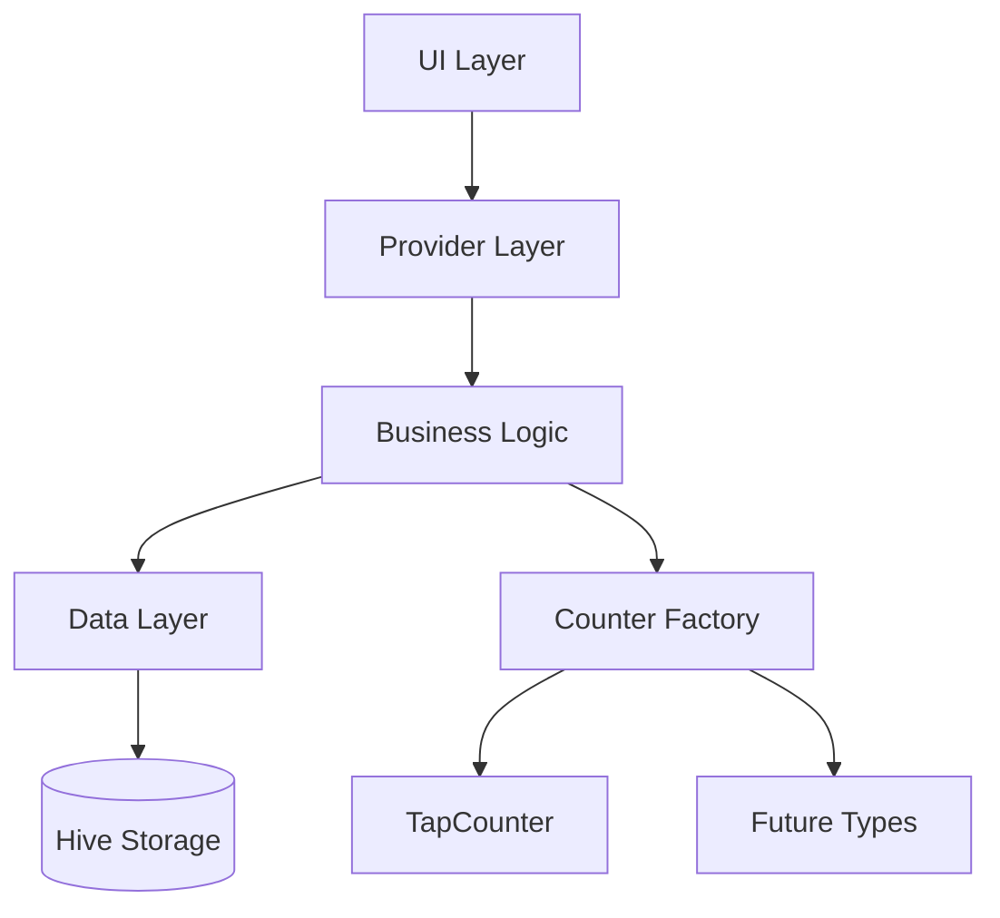
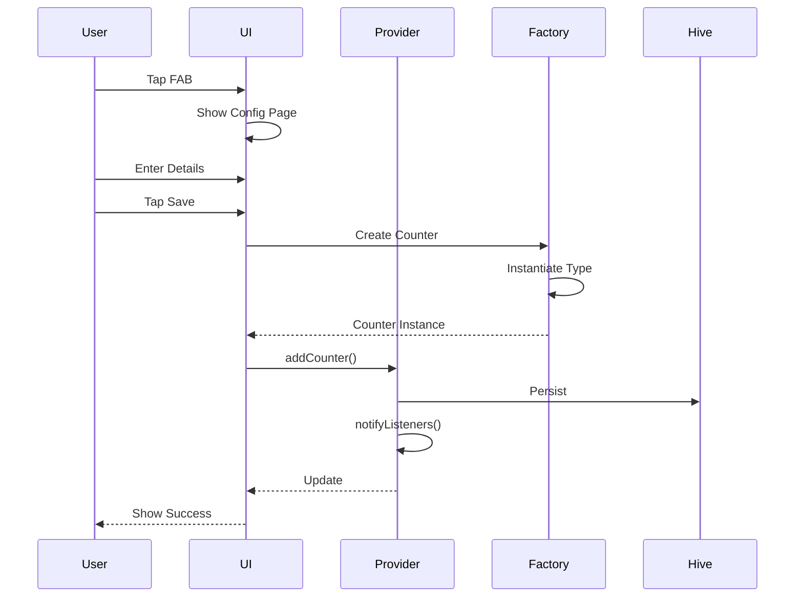
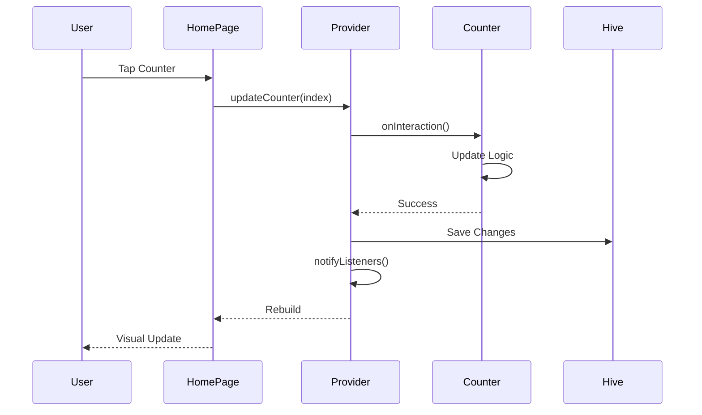
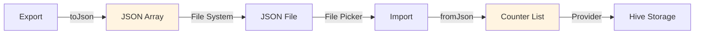

# Architecture Overview

Count App uses a clean, modular architecture with clear separation of concerns.

## High-Level Structure



## Core Components

### Counter System

All counters inherit from `BaseCounter` abstract class:

```dart
abstract class BaseCounter {
  String id;
  String name;
  int value;
  DateTime? lastUpdated;
  List<DateTime> updates;

  // Must implement
  String get counterType;
  Future<bool> onInteraction(BuildContext context);
  Widget buildIcon();
  Color getColor();
}
```

**CounterFactory** dynamically creates counters from JSON based on `counterType`.

### State Management

- **CounterProvider**: Manages counter list, uses `ChangeNotifier`
- **ThemeNotifier**: Handles theme state
- UI widgets use `Consumer<T>` to rebuild on state changes

### Data Persistence

- **Hive CE**: Type-safe binary storage
- **Type Adapters**: Generated with `build_runner`
- **Auto-save**: Provider automatically persists changes

## Directory Structure

```
lib/
├── counters/
│   ├── base/
│   │   ├── base_counter.dart      # Abstract class
│   │   └── counter_factory.dart   # Factory pattern
│   └── tap_counter/
│       ├── tap_counter.dart       # Implementation
│       └── tap_counter_config.dart # UI
├── providers/
│   └── counter_provider.dart      # State management
├── screens/                       # App screens
├── theme/                         # Theme system
└── utils/                         # Utilities
```

## Key Principles

- **Extensibility**: Add counter types without modifying existing code
- **Polymorphism**: All counters implement `BaseCounter`
- **Type Safety**: Strong typing with null safety
- **Single Responsibility**: Each class has one clear purpose

│ ├── home_page.dart # Counter list
│ ├── add_counter_page.dart # Type selection
│ ├── options_page.dart # Settings
│ ├── info_page.dart # App info
│ ├── about_page.dart # About
│ ├── guide_page.dart # User guide
│ ├── all_updates_page.dart # All updates view
│ └── update_page.dart # Single update view
├── theme/ # Theme configuration
│ └── theme_notifier.dart # Theme state management
├── utils/ # Utility functions
│ ├── constants.dart # App constants
│ ├── statistics.dart # Date/time utilities
│ ├── widgets.dart # Reusable widgets
│ ├── files.dart # File operations
│ ├── permissions.dart # Permission handling
│ ├── migration.dart # Data migration
│ └── updates.dart # Update utilities
├── hive_registrar.g.dart # Generated Hive registration
└── main.dart # Application entry point

````

## Design Patterns

### 1. Abstract Factory Pattern

`CounterFactory` creates counter instances based on type:

```dart
class CounterFactory {
  static BaseCounter fromJson(Map<String, dynamic> json) {
    final type = json["counterType"] as String?;

    switch (type) {
      case "tap":
        return TapCounter.fromJson(json);
      // More types...
      default:
        throw ArgumentError("Unknown counter type: $type");
    }
  }
}
````

### 2. Strategy Pattern

Each counter type implements its own update strategy:

```dart
// TapCounter: Simple tap to update
@override
Future<bool> onInteraction(BuildContext context) async {
  if (requireConfirmation) {
    final confirmed = await _showConfirmationDialog(context);
    if (!confirmed) return false;
  }

  value += isIncrement ? stepSize : -stepSize;
  return true;
}
```

### 3. Observer Pattern

Provider-based state management:

```dart
class CounterProvider with ChangeNotifier {
  void updateCounter(int index) {
    // Update counter
    notifyListeners(); // Notify all observers
  }
}
```

### 4. Builder Pattern

Widget builders for dynamic UI:

```dart
@override
Widget buildIcon() {
  return CircleAvatar(
    backgroundColor: getColor(),
    child: Icon(
      isIncrement ? Icons.add : Icons.remove,
      color: Colors.white,
    ),
  );
}
```

## Data Flow

### Counter Creation



### Counter Update



### Data Import/Export



## Key Architectural Decisions

### Why Abstract Base Class?

**Decision**: Use abstract `BaseCounter` instead of interfaces

**Rationale**:

- Shared implementation (id, name, value, updates)
- Default implementations (validate, getStatisticsPage)
- Common constructor logic
- Type safety for collections

### Why Provider over BLoC?

**Decision**: Use Provider for state management

**Rationale**:

- Simpler for this app's scope
- Less boilerplate
- Direct integration with Flutter
- Easy to test and mock

### Why Hive over SQLite?

**Decision**: Use Hive CE for persistence

**Rationale**:

- No-SQL flexibility
- Type-safe with code generation
- Fast binary serialization
- No native dependencies
- Cross-platform consistency

### Why Factory Pattern?

**Decision**: Use factory for counter instantiation

**Rationale**:

- Dynamic type determination from JSON
- Extensible for new types
- Single responsibility
- Easy to test

## Performance Considerations

### Efficient List Rendering

```dart
ListView.builder(
  itemCount: counters.length,
  itemBuilder: (context, index) {
    final counter = counters[index];
    return CounterTile(counter: counter); // Only builds visible items
  },
)
```

### Lazy Loading

```dart
Future<void> loadCounters() async {
  final box = await _getBox(); // Lazy initialization
  _counters = box.values.map(...).toList();
  notifyListeners();
}
```

### Selective Rebuilds

```dart
Consumer<CounterProvider>(
  builder: (context, provider, child) {
    // Only rebuilds when provider notifies
    return CounterList(counters: provider.counters);
  },
)
```

## Security Considerations

### Data Validation

- Input validation in UI and models
- Type checking with Dart's null safety
- Range validation for numeric inputs
- Sanitization before storage

### Permissions

- Request only necessary permissions
- Handle permission denial gracefully
- Platform-specific permission handling

## Scalability

The architecture supports:

- **Vertical**: More features per counter type
- **Horizontal**: More counter types
- **Data**: Efficient storage and retrieval
- **Platforms**: Easy platform addition

## Testing Strategy

### Unit Tests

- Counter logic
- Serialization/deserialization
- Validation rules
- Utility functions

### Widget Tests

- Counter UI components
- Configuration pages
- Statistics displays

### Integration Tests

- Complete user flows
- State management
- Data persistence

## Next Steps

Dive deeper into specific aspects:

- **[Core Concepts →](core-concepts.md)** - Fundamental concepts
- **[Counter System →](counter-system.md)** - Counter architecture
- **[State Management →](state-management.md)** - Provider details
- **[Data Persistence →](data-persistence.md)** - Hive implementation

## Related Documentation

- [Adding Counter Types](../guides/adding-counter-types.md)
- [BaseCounter API](../api/base-counter.md)
- [CounterProvider API](../api/counter-provider.md)
