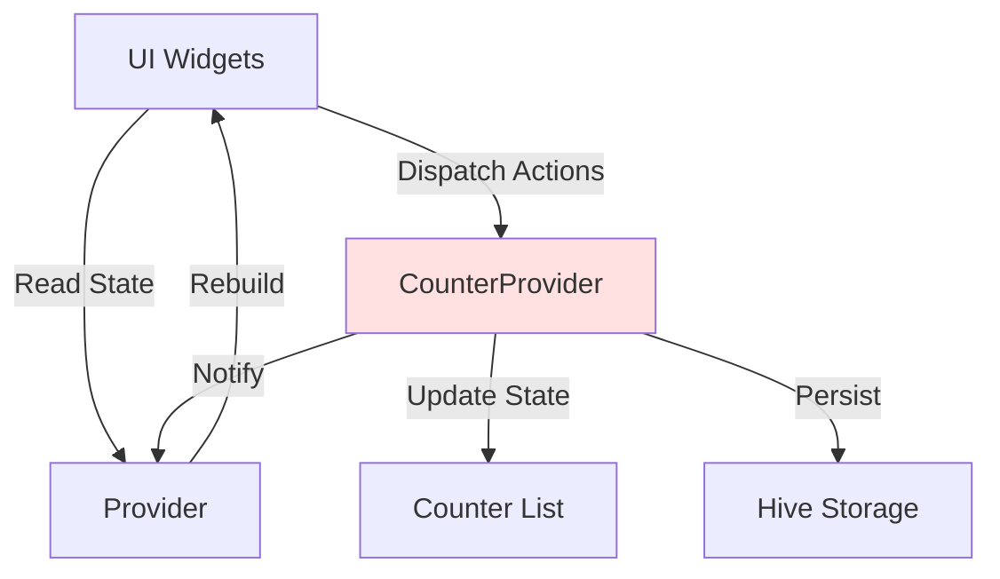

# State Management

Detailed documentation of the state management architecture using Provider.

## Provider Pattern

Count App uses the Provider pattern for state management, providing a reactive and predictable way to manage application state.

## Architecture



## CounterProvider

The main state provider for counters:

```dart
class CounterProvider with ChangeNotifier {
  List<BaseCounter> _counters = [];

  Future<void> loadCounters() async { /* ... */ }
  Future<void> addCounter(BaseCounter counter) async { /* ... */ }
  Future<void> updateCounter(BuildContext context, int index) async { /* ... */ }
}
```

See [CounterProvider API](../api/counter-provider.md) for full documentation.

## ThemeNotifier

Manages theme state:

```dart
class ThemeNotifier extends ChangeNotifier {
  ThemeMode _themeMode;

  void toggleTheme() { /* ... */ }
}
```

## Provider Setup

In `main.dart`:

```dart
MultiProvider(
  providers: [
    ChangeNotifierProvider(create: (_) => ThemeNotifier()),
    ChangeNotifierProvider(create: (_) => CounterProvider()),
  ],
  child: MainApp(),
)
```

## Consuming State

### Reading State

```dart
// Watch for changes (rebuilds on update)
final counters = context.watch<CounterProvider>().counters;

// Read once (no rebuilds)
final provider = context.read<CounterProvider>();
```

### Consumer Widget

```dart
Consumer<CounterProvider>(
  builder: (context, provider, child) {
    return ListView.builder(
      itemCount: provider.counters.length,
      itemBuilder: (context, index) {
        return CounterTile(counter: provider.counters[index]);
      },
    );
  },
)
```

## State Updates

### Synchronous Updates

```dart
void updateLocalState() {
  _counter++;
  notifyListeners();
}
```

### Asynchronous Updates

```dart
Future<void> updateWithPersistence() async {
  await _persist();
  notifyListeners();
}
```

## Best Practices

1. **Minimal Rebuilds**: Use `Consumer` to scope rebuilds
2. **Immutability**: Create new references for lists/maps
3. **Single Responsibility**: Each provider manages one domain
4. **Separation**: Keep business logic in providers

## See Also

- [CounterProvider](../api/counter-provider.md)
- [Core Concepts](core-concepts.md)
