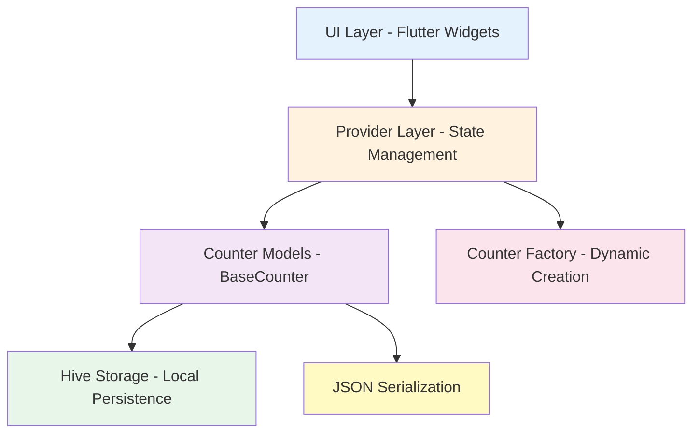

# Development setup (using `dev` branch)

This page describes how to set up a local development environment using the `dev` branch.

!!! note
    The Releases page contains pre-built APKs and platform binaries for users. The development guide below is for contributors or for building locally.

---

## Architecture Overview

Count App follows a layered architecture with clear separation of concerns:



**Key Components:**
- **UI Layer**: Flutter widgets and pages
- **Provider**: `CounterProvider` for state management
- **Models**: `BaseCounter` abstract class with concrete implementations (`TapCounter`, `SeriesCounter`)
- **Storage**: Hive for local persistence
- **Factory**: Dynamic counter creation from JSON

---

## Prerequisites

- Flutter SDK (stable channel recommended): https://docs.flutter.dev/get-started/install
- Dart SDK (bundled with Flutter)
- Git

---

## 1. Clone the `dev` branch

You can clone the `dev` branch directly to avoid an extra checkout step:

```bash
git clone -b dev --single-branch https://github.com/KingBenny101/countapp.git
cd countapp
```

Keeping on `dev` lets you work on the latest in-progress features and tests.

## 2. Install dependencies

```bash
flutter pub get
```

## 3. Initial setup — generate environment (run once)

Before running the app for the first time, run the environment generator which sets up icons and other assets. This only needs to be run once after cloning or when those resources change.

```bash
dart run tool/build.dart generate
```

## 4. Generate code (Hive adapters)

```bash
dart run build_runner build --delete-conflicting-outputs
```

## 6. Run locally

- Run the app for your target platform with `flutter run` (desktop or device):

```bash
flutter run
```

## 6. Build release artifacts

Count App provides a helper build script and standard Flutter build commands to produce release artifacts for each platform.

### Build script

The project includes `tool/build.dart` which wraps common tasks. Note that the `all` command builds for the current platform and Android (it does not build every possible platform).

```bash
# Generate environment (icons, package config) — run once after cloning
dart run tool/build.dart generate

# Clean build artifacts
dart run tool/build.dart clean

# Build for Android
dart run tool/build.dart build_android

# Build for Windows
dart run tool/build.dart build_windows

# Build for Linux
dart run tool/build.dart build_linux

# Build 'all' (current platform + Android)
dart run tool/build.dart all
```

### Output

- `release/countapp-{version}.apk` (Android)
- `release/windows/countapp/` (Windows executable + deps)
- `release/linux/countapp/` (Linux executable + deps)

### Version management

Set `version` in `pubspec.yaml`:

```yaml
version: 1.4.0 # MAJOR.MINOR.PATCH
```

The build script extracts the version and names output files accordingly.

## Troubleshooting

- If code generation fails, run `flutter clean` and re-run `build_runner`.
- If you see platform-specific permission or plugin errors on desktop, search the project issues or open a new issue with logs.

---

Helpful tips:

- Keep your local `dev` branch rebased on top of `origin/dev` regularly.
- Run `flutter analyze` and `dart format .` before opening PRs.
