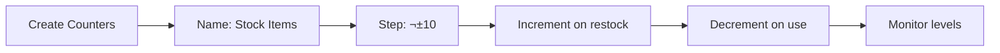

# Quick Start

## Run the App

```bash
flutter run
```

Or specify a platform:

```bash
flutter run -d android    # Android
flutter run -d windows    # Windows
flutter run -d linux      # Linux
```

## Creating a Counter

1. Tap the ➕ button
2. Select counter type (currently only "Tap Counter")
3. Configure:
   - **Name**: Counter name
   - **Step Size**: Increment/decrement value
   - **Direction**: Up or down
   - **Initial Count**: Starting value
4. Tap ➕ to create

## Using Counters

- **Tap counter** to update value
- **Long-press** for options (statistics, delete)
- **Menu** (⋮) for all updates, info, options, theme toggle

## Viewing Statistics

1. Long-press a counter and select "Statistics"
2. View charts showing:
   - Line chart: Value over time
   - Bar chart: Updates by day

## Import/Export

**Export**:

1. Menu → Options → Export Counters
2. JSON file saved to device

**Import**:

1. Menu → Options → Import Counters
2. Select JSON file

### Main Screen (Home)

The home screen shows all your counters:

```
┌─────────────────────────────┐
│  Count App          ⋮      │
├─────────────────────────────┤
│                             │
│  🔵 Water Intake            │
│     8 glasses               │
│     Step Size: +1           │
│                             │
│  🔵 Daily Steps             │
│     5,200 steps             │
│     Step Size: +100         │
│                             │
└─────────────────────────────┘
              ➕
```

- **App Bar**: Title, options menu, theme toggle
- **Counter List**: All your counters
- **FAB**: Add new counter

### Options Menu

Tap the menu icon (⋮) to access:

- **All Updates**: View all counter updates across all counters
- **Info**: App information and version
- **Options**: Settings and preferences
- **Theme Toggle**: Switch between light/dark mode

## Exploring Statistics

### Access Statistics

1. **Select a counter** (long-press to enter selection mode)
2. **Tap Statistics button** in the action bar
3. **View detailed analytics**:
   - Daily update frequency chart
   - Total updates count
   - Average updates per day
   - Most active day
   - Update history timeline

### Understanding Charts

The statistics page includes:

- **Bar Chart**: Updates by day of week
- **📈 Line Chart**: Update trends over time
- **📅 Calendar View**: Daily update counts
- **📜 Update History**: Chronological list of all updates

## Data Management

### Export Data

Export all counter data to JSON:

1. Go to **Options** menu (⋮)
2. Select **Export Data**
3. Choose save location
4. JSON file is created with all counters

### Import Data

Import previously exported data:

1. Go to **Options** menu (⋮)
2. Select **Import Data**
3. Choose JSON file
4. Confirm to import

!!! warning "Import Warning"
Importing will replace all existing counters. Export your current data first if needed!

## Keyboard Shortcuts

When running on desktop (Windows/Linux):

| Action          | Shortcut       |
| --------------- | -------------- |
| Add Counter     | `Ctrl+N`       |
| Delete Selected | `Delete`       |
| Select All      | `Ctrl+A`       |
| Deselect All    | `Escape`       |
| Toggle Theme    | `Ctrl+Shift+T` |

## Example Workflows

### Workflow 1: Daily Habit Tracking


1. Create "Water Intake" counter with step size +1
2. Tap once each time you drink a glass of water
3. View statistics to see daily patterns
4. Adjust habits based on data

### Workflow 2: Project Tracking


1. Create "Bug Fixes" counter with step size +1
2. Increment for each bug fixed
3. Export data weekly for reporting
4. Analyze productivity trends

### Workflow 3: Inventory Management



1. Create counter for each inventory item
2. Use increment direction for restocking
3. Use decrement direction for consumption
4. Monitor stock levels in real-time

## Tips & Tricks

!!! tip "Confirmation Dialogs"
Disable confirmation dialogs in counter settings for faster updates. Useful for high-frequency counting.

!!! tip "Step Size Strategy"
Use larger step sizes (10, 100) for counts that change in batches, like inventory or batch processing.

!!! tip "Naming Convention"
Use clear, descriptive names with categories: "Health: Water Intake", "Work: Tasks Completed"

!!! tip "Regular Exports"
Export your data regularly to prevent loss. Consider weekly or monthly backups.

## Common Tasks

### Task: Reset a Counter

Currently, to reset a counter:

1. Note the counter configuration
2. Delete the counter
3. Create a new counter with the same settings

### Task: Duplicate a Counter

To create a similar counter:

1. Export data
2. Open JSON file in text editor
3. Copy counter configuration
4. Modify as needed
5. Import modified JSON

### Task: Bulk Delete

To delete multiple counters:

1. Long-press to enter selection mode
2. Tap all counters to delete
3. Tap delete button (🗑️)
4. Confirm deletion

## Next Steps

Now that you're familiar with the basics:

- **[Building →](building.md)** - Create release builds for distribution
- **[Architecture →](../architecture/overview.md)** - Understand how the app works
- **[Adding Counter Types →](../guides/adding-counter-types.md)** - Extend the app with new counter types
- **[User Guide →](../user-guide/features.md)** - Explore all features in detail

## Troubleshooting

### App Won't Start

```bash
flutter clean
flutter pub get
dart run build_runner build --delete-conflicting-outputs
flutter run
```

### Counters Not Saving

Check permissions:

- Android: Storage permissions
- Windows/Linux: Write permissions to app directory

### UI Not Updating

Try hot restart instead of hot reload:

- Press `R` in terminal
- Or restart the app completely

!!! success "You're Ready!"
You now know the basics of Count App. Start creating counters and tracking your data!
