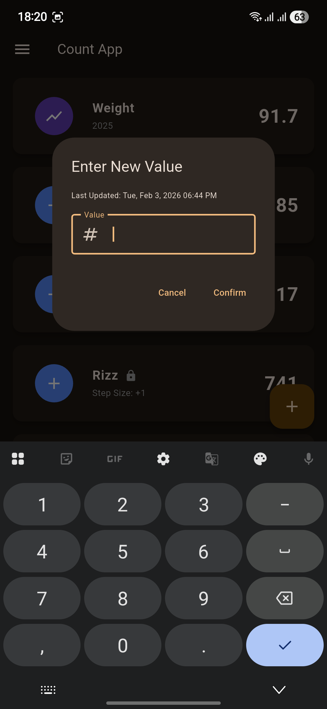

# Counter Types Guide

Count App offers two powerful counter types, each designed for specific tracking needs. This guide will help you choose the right counter type and configure it effectively.

---

## Quick Comparison

| Feature          | Tap Counter                          | Series Counter                  |
| ---------------- | ------------------------------------ | ------------------------------- |
| **Icon**         | + / -                                | Chart                           |
| **Color**        | Blue                                 | Deep Purple                     |
| **Input Method** | Single tap                           | Numeric value entry             |
| **Best For**     | Counting discrete events             | Tracking measurements over time |
| **Update Speed** | Instant (with optional confirmation) | Requires value input            |
| **Statistics**   | Update frequency, daily counts       | Averages, trends, highs/lows    |
| **Chart Type**   | Frequency over time                  | Value trends over time          |
| **Examples**     | Steps, habits, repetitions           | Weight, temperature, revenue    |

---

## Tap Counter

### Overview

Tap Counter is designed for quick, frequent counting of discrete events. It's perfect when you need to track "how many times" something happens without entering specific values.

### When to Use

**Ideal for:**

- Counting discrete events or occurrences
- Quick updates without typing
- Simple increment/decrement tracking
- Situations where speed is important

**Not ideal for:**

- Tracking values that vary significantly
- When you need to record specific measurements
- Analyzing trends in numeric values

### Example Use Cases

- **Daily Habits:** Water glasses consumed, pages read, meditation sessions
- **Exercise:** Push-ups, sit-ups, laps completed
- **Productivity:** Tasks completed, emails sent, calls made
- **Tracking:** Days since last incident, books finished this month
- **Inventory:** Items remaining, stock count

### Configuration Options

#### Step Size

The amount to add or subtract per tap.

- **Small values (1-5):** Precise counting, individual items
- **Medium values (10-50):** Grouped counting, batches
- **Large values (100+):** Quick accumulation, large quantities

**Example:** If tracking water intake in 8oz glasses, use step size 1. If tracking in milliliters, use step size 250.

#### Direction

**Increment (+):** Count up from a starting value

- Most common use case
- Examples: Daily steps, completed tasks, money saved

**Decrement (-):** Count down from a starting value

- Examples: Days until deadline, items remaining, countdown trackers

#### Require Confirmation

**Enabled (default):** Shows confirmation dialog before each update

- **Pros:** Prevents accidental taps
- **Cons:** Slower updates
- **Best for:** Important counters, infrequent updates

**Disabled:** Updates immediately on tap

- **Pros:** Faster workflow
- **Cons:** Risk of accidental updates
- **Best for:** Frequently updated counters, quick tracking

!!! tip
Disable confirmation for counters you update many times per day (like step tracking). Keep it enabled for important counters that change less frequently.

---

  

## Series Counter

  

### Overview

Series Counter is designed for tracking numeric values that change over time. It stores each value with a timestamp, enabling trend analysis and statistical insights.

### When to Use

**Ideal for:**

- Recording measurements that vary
- Tracking trends over time
- Analyzing patterns and statistics
- Values that need context (date/time)

**Not ideal for:**

- Simple counting (use Tap Counter instead)
- When you don't need historical data
- Rapid, frequent updates

### Example Use Cases

- **Health Tracking:** Body weight, blood pressure, heart rate, temperature
- **Financial:** Daily revenue, expenses, account balance
- **Performance:** Test scores, workout times, sales numbers
- **Environmental:** Temperature readings, humidity levels
- **Personal:** Mood ratings, energy levels, sleep hours

### Configuration Options

#### Description

Optional text field to provide context for the counter.

**Tips:**

- Include units of measurement (e.g., "in kilograms", "in USD")
- Mention tracking frequency (e.g., "Daily morning weight")
- Add relevant context (e.g., "Before breakfast")

**Examples:**

- "Body weight in kg (morning, before breakfast)"
- "Daily revenue in USD"
- "Resting heart rate (bpm)"

#### Initial Value

The first value in your series.

**Best practices:**

- Use your current measurement as the starting point
- Ensure units match your tracking system
- Supports decimal values (e.g., 75.5, 98.6)

### Statistics Available

Series Counters provide rich analytics:

**Time-Based Averages:**

- Weekly average (last 7 days)
- Monthly average (last 30 days)

**Extremes:**

- Weekly high and low
- All-time highest and lowest values

**Visualizations:**

- Interactive line charts
- Time-range filtering (1W, 1M, 3M, 1Y, All)
- Trend analysis

!!! note
Series counters store the complete history of values, making them perfect for long-term trend analysis and pattern recognition.

---

## Choosing the Right Counter Type

### Decision Guide

Ask yourself these questions:

1. **Do I need to track specific values or just count occurrences?**
   - Specific values → **Series Counter**
   - Count occurrences → **Tap Counter**

2. **Will I update this many times per day?**
   - Yes, frequently → **Tap Counter**
   - No, occasionally → Either works

3. **Do I need to see trends over time?**
   - Yes → **Series Counter**
   - No → **Tap Counter**

4. **Are the values always the same increment?**
   - Yes → **Tap Counter**
   - No, they vary → **Series Counter**

### Examples by Category

| Category         | Use Case              | Recommended Type | Why                                    |
| ---------------- | --------------------- | ---------------- | -------------------------------------- |
| **Health**       | Daily steps           | Tap Counter      | Consistent increment, frequent updates |
| **Health**       | Body weight           | Series Counter   | Values vary, trend analysis needed     |
| **Finance**      | Cups of coffee bought | Tap Counter      | Counting occurrences                   |
| **Finance**      | Daily expenses        | Series Counter   | Values vary significantly              |
| **Productivity** | Tasks completed       | Tap Counter      | Simple counting                        |
| **Productivity** | Hours worked          | Series Counter   | Values vary, need averages             |

---

## Best Practices

### Naming Conventions

**Good counter names:**

- "Daily Water (8oz glasses)" - Includes units and context
- "Morning Weight (kg)" - Specifies timing and units
- "Work Tasks Completed" - Clear and descriptive

**Avoid:**

- "Counter 1" - Not descriptive
- "Water" - Missing context
- "Stuff" - Too vague

### Organization Tips

1. **Use consistent naming:** Start with category (Health, Finance, etc.)
2. **Include units:** Always specify measurement units
3. **Add timing context:** Morning, daily, weekly, etc.
4. **Be specific:** "Push-ups" not just "Exercise"

### Data Management

- **Regular exports:** Back up your data using JSON export
- **Review statistics:** Check trends weekly or monthly
- **Clean up:** Remove counters you no longer use
- **Document changes:** If you change tracking methods, note it in the description

---

## Advanced Usage

### Combining Counter Types

You can use both types together for comprehensive tracking:

**Example: Fitness Tracking**

- **Tap Counter:** Daily workout sessions completed
- **Series Counter:** Body weight measurements
- **Tap Counter:** Glasses of water consumed
- **Series Counter:** Resting heart rate

This gives you both frequency data (how often) and measurement data (specific values).

### Migration Between Types

If you start with one type and realize you need the other:

1. **Export** your current counter data (JSON)
2. **Create** a new counter of the desired type
3. **Manually transfer** key data if needed
4. **Archive** the old counter (or delete after export)

!!! warning
Counter types cannot be converted directly. Plan your counter type carefully based on your tracking needs.

---

## See Also

- **[Using the App](using-the-app.md)** - Learn how to create and manage counters
