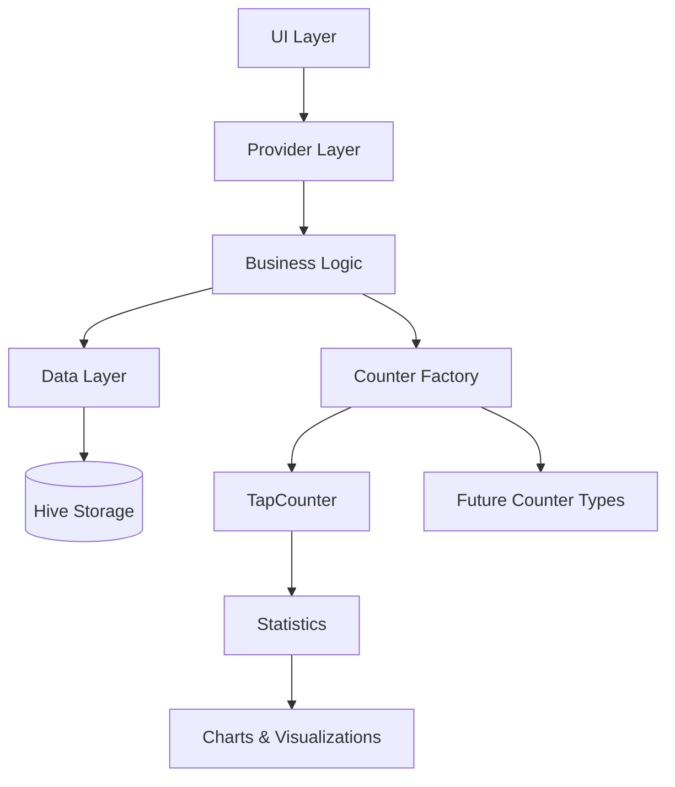

# Count App Documentation

Welcome to the comprehensive documentation for **Count App** - a modern, extensible Flutter application for tracking counters with rich statistics and visualization capabilities.

## Overview

Count App is a sophisticated counter tracking application built with Flutter, featuring an extensible architecture that allows for multiple counter types, comprehensive statistics, and seamless data management.

### Key Features

- Multiple Counter Types: Extensible system supporting various counter implementations
- Rich Statistics: Detailed analytics with interactive charts and visualizations
- Data Persistence: Reliable local storage using Hive CE
- Theme Support: Beautiful dark and light themes
- Import/Export: JSON-based data portability
- Backward Compatible: Migration support for older versions
- Cross-Platform: Runs on Android, Windows, and Linux

## Quick Links

- [Quick Start](getting-started/quick-start.md) - Get up and running in minutes
- [Architecture](architecture/overview.md) - Learn about the clean, extensible architecture design
- [API Reference](api/base-counter.md) - Comprehensive API documentation for all classes and methods
- [Adding Counter Types](guides/adding-counter-types.md) - Step-by-step guide to extending the app

## Architecture Highlights

Count App uses a clean, modular architecture with clear separation of concerns:

### Core Principles

- **Extensibility**: Add new counter types without modifying existing code
- **Polymorphism**: All counters inherit from `BaseCounter` abstract class
- **Separation of Concerns**: Clear boundaries between UI, business logic, and data
- **State Management**: Provider pattern for reactive state updates
- **Type Safety**: Strong typing with Dart and code generation

## Platform Support

| Platform | Status    | Minimum Version      |
| -------- | --------- | -------------------- |
| Android  | Supported | Android 5.0 (API 21) |
| Windows  | Supported | Windows 10+          |
| Linux    | Supported | Ubuntu 20.04+        |
| iOS      | Planned   | -                    |
| macOS    | Planned   | -                    |
| Web      | Planned   | -                    |

## Technology Stack

- **Framework**: Flutter 3.3.3+
- **Language**: Dart 3.3.3+
- **State Management**: Provider 6.1.2
- **Local Storage**: Hive CE 2.7.0+
- **Charts**: FL Chart 1.1.0, Syncfusion Charts 31.1.17
- **Code Generation**: build_runner, hive_ce_generator

## Getting Started

Ready to dive in? Start with one of these guides:

1. [Installation](getting-started/installation.md) - Set up your development environment
2. [Quick Start](getting-started/quick-start.md) - Build and run the app
3. [Building](getting-started/building.md) - Create release builds for all platforms

## Documentation Structure

- **Getting Started**: Installation, setup, and first steps
- **Architecture**: Deep dive into the app's design and structure
- **API Reference**: Complete API documentation for all classes
- **Guides**: How-to guides for extending the application

## Support

- **Issues**: [GitHub Issues](https://github.com/KingBenny101/countapp/issues)
- **Source Code**: [GitHub Repository](https://github.com/KingBenny101/countapp)
