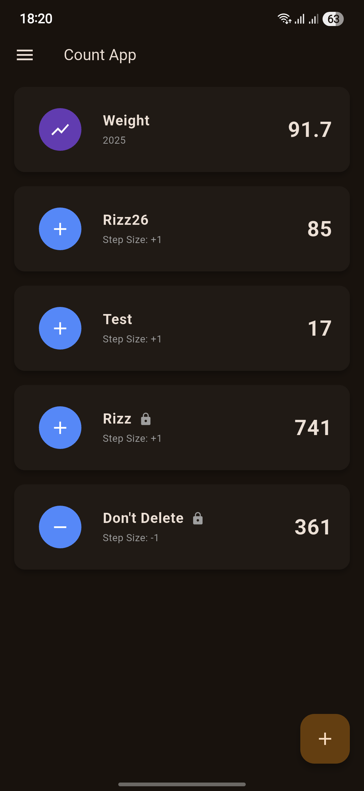
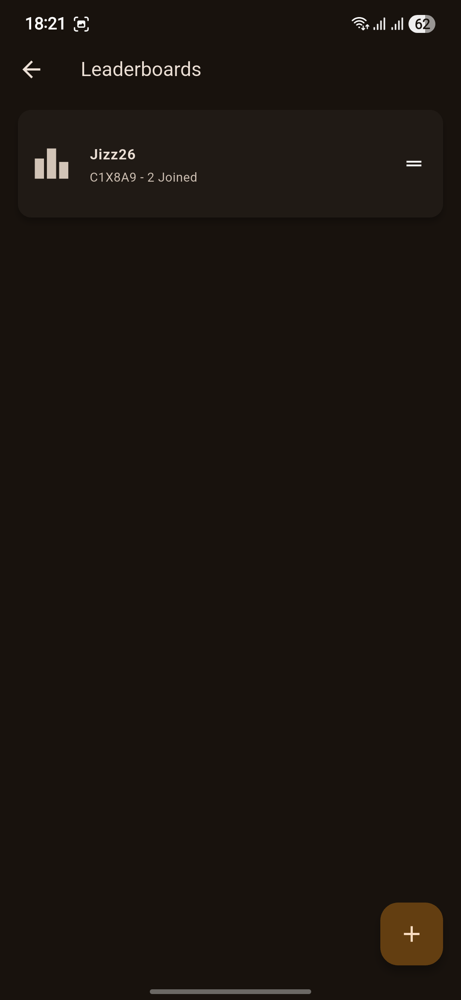
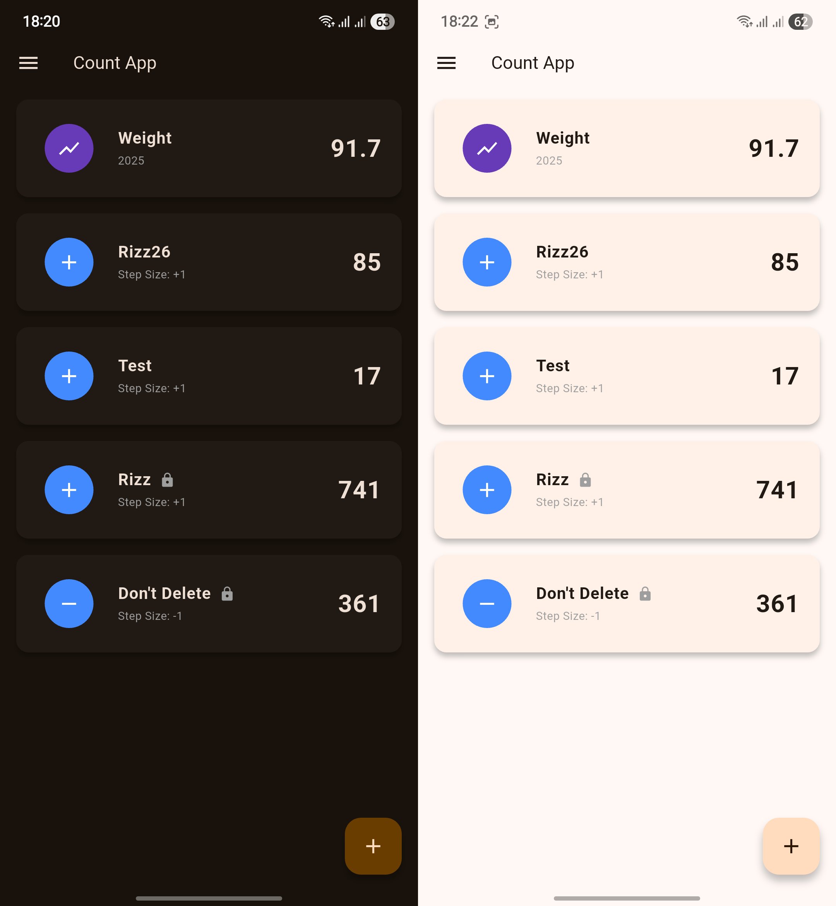
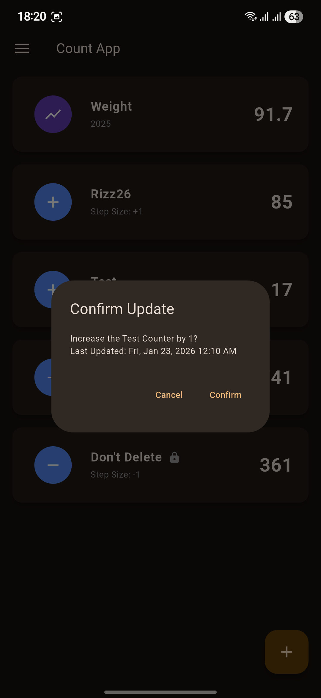

# Count App

> **A powerful, extensible counter tracking application for Android, Windows, and Linux**

Track counts and numeric series effortlessly with a beautiful, intuitive interface. Whether you're counting daily habits, monitoring body metrics, or tracking business data, Count App provides the tools you need.
 

  
    

---

## Features

-   :material-counter: **Multiple Counter Types**

    ---

    Choose between **Tap Counters** for quick counting and **Series Counters** for trend tracking over time.

    

      
    

-   :material-chart-line: **Rich Statistics**

    ---

    Interactive charts, averages, highs/lows, and flexible time-range filtering (1W, 1M, 3M, 1Y, All).

    

      
    

-   :material-trophy: **Leaderboards**

    ---

    Compete with friends and family by joining shared leaderboards with 6-character codes.

    

      
    

-   :material-palette: **Beautiful Themes**

    ---

    Modern design with automatic dark/light theme support that adapts to your system preferences.

    

      
    

-   :material-database-export: **Data Control**

    ---

    Full JSON export/import for backups and data portability. Your data stays under your control.

    

      
    

---

## Quick Start

Ready to get started? Check out our **[Quick Start Guide](guides/quick-start.md)** to be up and running in minutes.

1. **[Download](getting-started/installation.md)** the app
2. **Create** a counter
3. **Track** your progress!
   
   Update your counters and view detailed statistics and charts

!!! tip "New to Count App?"
    Start with the [Using the App](guides/using-the-app.md) guide for a complete walkthrough!

---

## Counter Types

### Tap Counter
**Perfect for:** Quick counting of discrete events

- Single-tap updates with configurable step size
- Increment or decrement mode
- Optional confirmation dialogs
- **Use cases:** Daily water intake, exercise reps, books read, tasks completed

  

### Series Counter
**Perfect for:** Tracking values that change over time

- Record numeric measurements with timestamps
- View trends with interactive charts
- Calculate averages, highs, and lows
- **Use cases:** Body weight, daily revenue, temperature logs, stock prices

  

[Learn more about counter types →](guides/counters.md)

---

## Leaderboards

Compete with friends and family using shared leaderboards!

- Create or join leaderboards with simple 6-character codes
- Attach any counter to a leaderboard
- Real-time rankings and comparisons
- Perfect for fitness challenges, habit tracking competitions, and more

  

[Learn how to use leaderboards →](guides/leaderboards.md)

---

## Key Capabilities

### Data Management
- **Export** your counters to JSON for backups
- **Import** from previous exports to restore or migrate data
- Full control over your data with human-readable JSON format

### Statistics & Analytics
- Daily, weekly, and monthly trends
- Interactive time-range filtering
- Update frequency analysis
- Visual charts and graphs

### Customization
- Automatic dark and light theme support
- Configurable counter behavior
- Extensible architecture for developers

---

## Documentation Guide

### For Users

Perfect for getting started as an end user:

- **[Installation Guide](getting-started/installation.md)** - Download and install the app
- **[Using the App](guides/using-the-app.md)** - Learn the basics and common workflows
- **[Counter Types](guides/counters.md)** - Understand Tap vs Series counters in detail
- **[Leaderboards](guides/leaderboards.md)** - Create and join competitive leaderboards

### For Developers

Welcome developers! Here's how to get started:

- **[Development Setup](developers/setup.md)** - Set up your local environment
- **[API Reference](api/base-counter.md)** - Explore the codebase architecture
- **[Adding Counter Types](developers/adding-counter-types.md)** - Extend the app with custom counters

---

## Support & Community

Need help or want to contribute?

- **[GitHub Issues](https://github.com/KingBenny101/countapp/issues)** - Report bugs or request features
- **[Source Code](https://github.com/KingBenny101/countapp)** - View the code and contribute
- **[Development Guide](developers/setup.md)** - Learn how to build from source

---

## License

Count App is open source software licensed under the MIT License.

---

!!! note "Latest Release"
    Version 1.5.7 is now available! Visit the [GitHub releases page](https://github.com/KingBenny101/countapp/releases) to download.
